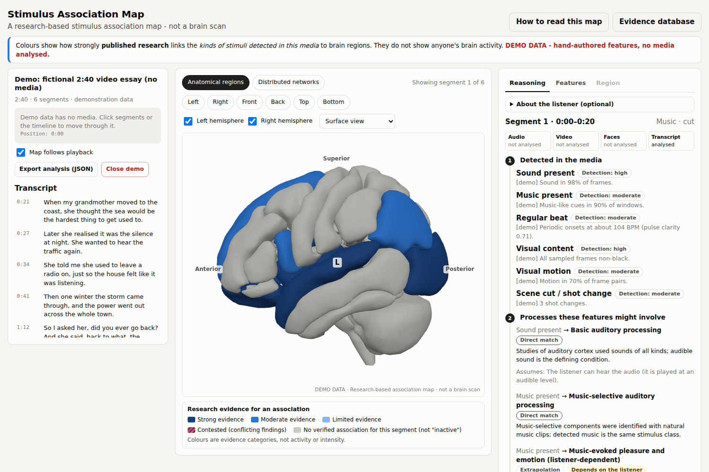
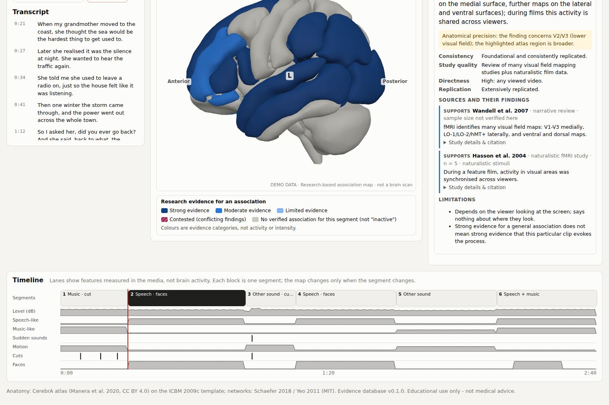
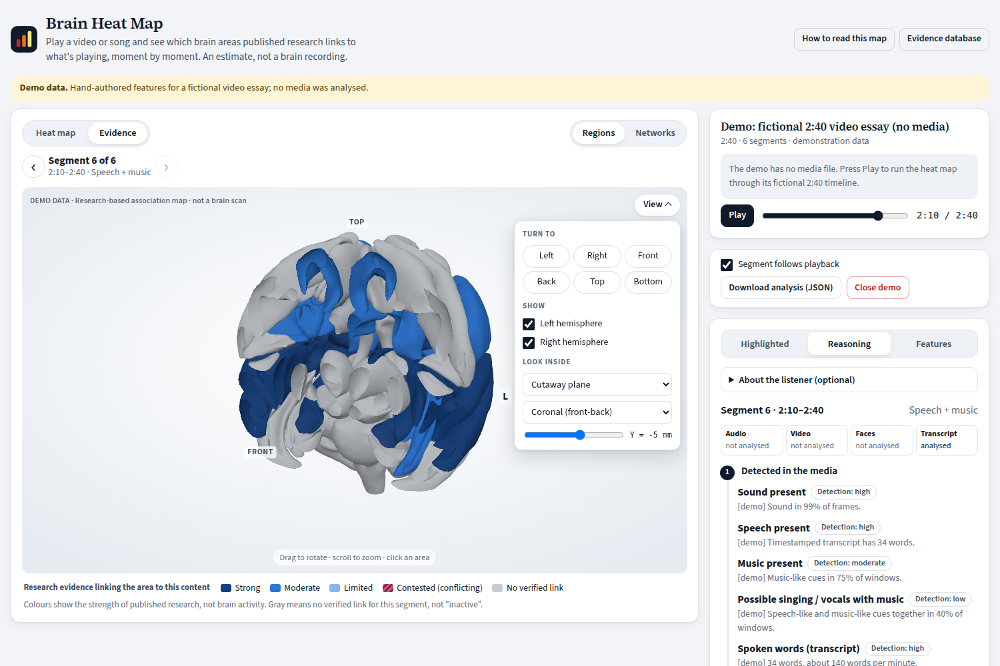
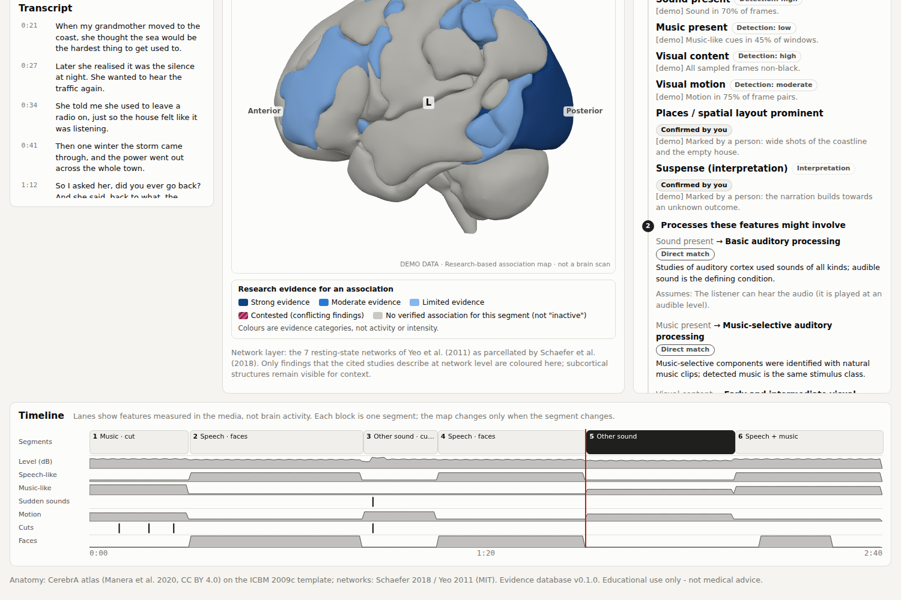
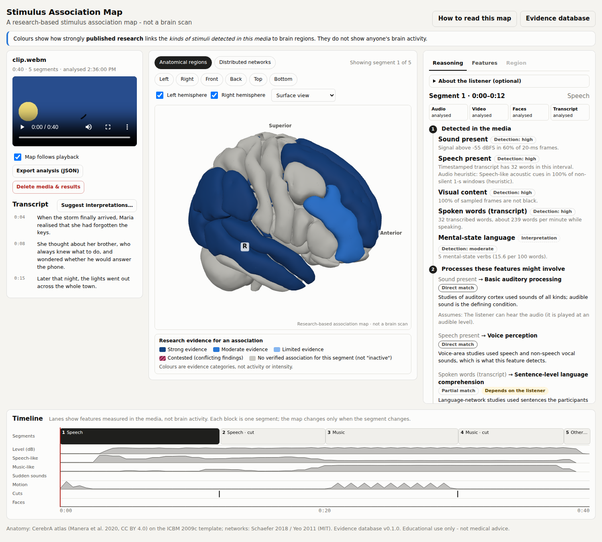

# Stimulus Association Map

An educational web app. You load a video, song, or podcast, and it shows which brain regions
and networks **published research associates with the kinds of stimuli detected in that
media**. It is a *research-based stimulus association map*, **not a brain scan**. It never
measures, predicts, or simulates anyone's neural activity.



## Feasibility: what can and cannot be done honestly

| Goal | Feasible? | How it is handled |
|---|---|---|
| Detect observable features in media | Yes, locally in the browser | Audio signal processing (level, onsets, beat, speech/music heuristics), frame sampling (motion, cuts, brightness, face presence), transcript lexical cues. Every feature carries a *detection confidence*. |
| Link features to cognitive processes | Partly | Reviewed rules. Each rule says whether applying the research is a **direct match**, **partial match**, or **extrapolation** that depends on the listener. |
| Link processes to regions and networks | Yes, at regional level, where evidence exists | Only curated, cited evidence records can colour a region. Each is graded **strong / moderate / limited / contested**. Anything else is gray, meaning "insufficient evidence". |
| Say what *your* brain is doing, how intensely, or infer dopamine, hormones, or emotions | **No** | Not attempted. fMRI evidence is indirect (blood oxygenation), group-level, and context-dependent. The app shows explicit "not mapped" records explaining why. |
| Voxel-precise hotspots | No (evidence is regional) | Whole atlas regions are highlighted. Functional areas without an atlas label (FFA, MT+, SMA, TPJ) are marked "≈" (approximate). |
| Use Neurosynth / NeuroQuery maps as predictions | No | They were considered as curation aids only. Their maps summarise literature coordinates for terms and are not validated predictions for arbitrary stimuli. |

## Quick start

```bash
cd neuro-stimulus-map
npm install
npm run dev        # http://localhost:5173
npm test           # evidence-database, pipeline and analysis tests
npm run build      # type-check + production build (dist/ is a static site)
```

Click **Explore demo data** to try the interface without a file. The demo is hand-authored
and labelled "DEMO DATA" everywhere. Or drop in a media file, optionally with a timed
transcript (`.srt`, `.vtt`, Whisper-style `.json`).

## Use it on iPhone or iPad

The app is a static site that runs entirely in the browser, so there are three ways to open it
on a phone or tablet:

1. **Hosted copy.** `npm run build:hosted` writes `dist-hosted/`, a variant for sandboxed web
   viewers such as a claude.ai artifact. There, binary files are published as base64 text,
   exports copy to the clipboard instead of downloading, and the two optional network features
   (speech recognition and interpretation suggestions) are switched off, because the viewer
   blocks requests to other sites. `node e2e/hosted.mjs` checks this build under a strict
   Content-Security-Policy.
2. **From your computer over Wi-Fi.** Run `npm run preview:phone` (production build) or
   `npm run dev:phone` (live reload). Vite prints a `Network:` address such as
   `http://192.168.1.20:4173`. Open it in Safari on a device on the same Wi-Fi network.
3. **Any static host.** `npm run build` writes `dist/`, which can be served from any static
   host (GitHub Pages, Netlify, an S3 bucket and so on). Asset paths are relative.

With options 2 and 3, tap **Share → Add to Home Screen** in Safari to open it full-screen like
an app, with its own icon. Uploading uses the normal iOS file picker, so you can pick from Photos, Files or
iCloud Drive.

On touch screens:

- **Tap** a region to see its name and grade, then **Details** for the evidence. **Drag** with
  one finger to rotate, and **pinch** to zoom.
- On narrow screens the timeline shows segment times only, and dialogs open as bottom sheets.

iPhone and iPad notes:

- Video from Photos is usually HEVC or H.264 in a `.mov`/`.mp4` file. Safari decodes these
  itself, so the build environment's lack of those codecs does not apply on iOS.
- Long non-WAV/MP3 files are decoded in one piece, and iOS gives a browser tab less memory than
  a desktop. For podcasts over about 45 minutes, prefer MP3 or WAV.
- The iOS and iPadOS layouts were tested with iPhone 13, iPad Pro 11 and iPad Pro 11 landscape
  emulation in Chromium over a plain-http LAN address (`node e2e/mobile.mjs`), not on a
  physical device with WebKit. The Safari-specific code paths (in-page muted `playsinline`
  video, sample-rate fallbacks, callback-style audio decoding, non-secure-context IDs) follow
  WebKit's documented behaviour but have not been run on real Safari.

## Use it as a tool for other AI models

The evidence database, mapping rules and audio/transcript analysis are also packaged as a
tool other AI systems can call: an **MCP server** (for Claude, Meta Muse Code and other agents
that support the Model Context Protocol), an **HTTP API with an OpenAPI 3.1 description and MCP
over HTTP** (for cloud agents and API connectors), a **CLI**, and plain **JSON-Schema function
definitions**. Every result carries the "not a brain scan" disclaimer, the evidence grades and
citations. See [`tool/README.md`](tool/README.md) for setup.

```bash
npm run build:tool                    # bundles tool-dist/*.mjs (committed; needs only Node 20+)
npm run mcp                           # MCP over stdio
npm run api -- --port 8787            # HTTP API: /openapi.json, /tools/{name}, /mcp
node tool-dist/cli.mjs features speech_present,faces_visible
```

## How it works: an auditable pipeline

```
media ──► detected features ──(rules: data/evidence/rules.json)──► candidate processes
                                                                        │
          anatomical view ◄── regions / networks ◄──(associations.json + sources.json)
```

1. **Detect** (`src/analysis/`). This runs entirely in the browser tab.
   - Audio is decoded to 16 kHz mono. WAV is streamed and MP3 is decoded frame-aligned in chunks, so long podcasts don't need to fit in memory. Other containers are decoded whole by the browser. Per 20 ms frame the app computes level, spectral flux, zero crossings, spectral similarity, and flatness. From those it derives speech/music heuristics per 1-second window, beat periodicity (autocorrelation, 50–200 BPM), abrupt onsets (a rise of at least 20 dB over the preceding second), and loudness range.
   - Video frames are sampled by seeking a hidden `<video>` element (0.5–2 s spacing, depending on length) at 96 px width. The app computes histogram cuts (with flash rejection), block-matching motion and changed-pixel fraction, and brightness changes. Face *presence* comes from TinyFaceDetector (bundled weights). No identity or expression analysis is done.
   - For the transcript, the app computes word counts, speaking rate, and lexical cues (mental-state verbs, narrative connectives, laughter annotations, emotion words). These are labelled as interpretations.
   - Segments are cut at changes in audio class, cuts, sudden sounds, and transcript pauses, within length limits that scale with the media's duration.
2. **Link.** Every rule in `rules.json` names a feature, a process, an applicability level, a minimum detection confidence, and the assumptions it makes about the person. Interpretive features only count once a person confirms them.
3. **Look up.** `src/pipeline/mapping.ts` can only reach a region through an `Association` record, and every association must cite at least one supporting source (this is enforced by tests and at app start-up). A process with no association returns an explicit **insufficient evidence** record from `unsupported.json`.
4. **Show.** The 3D view uses the CerebrA atlas. It has left and right labels, orientation labels, camera presets, hemisphere toggles, a see-through cortex mode, and sagittal, coronal, and axial cutaways for internal structures. A second layer shows the Yeo 7 networks. Clicking a region shows the detected feature, the proposed process, whether the research applies directly, the claim, a grade rationale (consistency, quality, directness, replication), each source's actual finding and design, and the limitations.

### Design choices that keep it from reading as a brain scan

- Colours are an ordinal single-hue **evidence** scale plus striped magenta for *contested*. The palette was validated for colour-vision deficiency and has light and dark variants. There is no red-yellow "heat" palette.
- Gray is labelled "no verified association for this segment (not inactive)".
- The map switches only when the segment changes. There is no pulsing or animation tied to playback. The timeline lanes are labelled "features measured in the media, not brain activity".
- Every panel keeps three things separate: *detection confidence* (the software), *evidence grade* (the research), and *applicability* (research → this clip). The text states that strong general evidence ≠ strong evidence for this clip.
- An optional "About the listener" card (understands the language? enjoys the music? finds it funny?) shows how findings depend on the person. Answering "No" removes associations that assume it.
- The "Show only this on map" option isolates a single association so a busy map can be read one claim at a time.

| | |
|---|---|
|  |  |
|  |  |

## Evidence database (`data/evidence/`)

Separate from the UI and reviewable as plain JSON. `npm run evidence:table` renders it to
[`docs/EVIDENCE_TABLE.md`](docs/EVIDENCE_TABLE.md).

| File | Contents |
|---|---|
| `sources.json` | 51 sources: citation, DOI/PMID/link, design, method, population, sample size (or `null` when it could not be verified), stimuli, comparison, findings, limitations, whether stimuli were naturalistic, and verification level/date/URLs |
| `associations.json` | 26 process → region/network associations with exact claim text, grade, per-criterion rationale, citations with role (supports / qualifies / conflicts) and finding, and limitations |
| `rules.json` | 28 feature → process rules with applicability, minimum detection confidence, confirmation requirement, rationale and assumptions |
| `unsupported.json` | 9 deliberate non-mappings (emotion categories, "fear/pleasure centres", dopamine/hormones, activation levels, tempo values, narrative surprise, loudness → fear, Neurosynth maps as predictions, face identity/expression) |
| `regions.json`, `networks.json`, `processes.json`, `features.json`, `meta.json` | Region orientation text, network descriptions, process and feature definitions, grading and applicability rubrics |

Conflicting findings are shown rather than hidden. Examples: whether music engages Broca's-area
language regions (Koelsch et al. 2002 vs Chen et al. 2023), left-lateralised vs bilateral
semantic maps (Binder et al. 2009 vs Huth et al. 2016), nucleus accumbens in humor
(Vrticka et al. 2013 vs Farkas et al. 2021), and the reliability of rhythm features in
naturalistic music (Burunat et al. 2016).

### Verification status: please read

The build environment's network policy blocked PubMed, PMC, Crossref, Neurosynth, and
publisher sites, including the two starting points named in the brief (the Neurosynth FAQ
and PMC3146590). Every source was therefore checked against **search-engine records that
point to PubMed or publisher pages**. That confirms bibliographic details and gives
abstract-level findings, but **no record has been verified against the full abstract page
or full text**. The app says this for every source (`verification.level: "search-index"`),
and a test prevents the level from being overstated. Details that could not be confirmed are
omitted rather than guessed. That covers several sample sizes, some page ranges, and author
lists beyond the confirmed names. DOIs come from the search results or from publisher
article URLs that embed the DOI. One (NeuroQuery, eLife) was inferred from the journal's
numbering pattern and is flagged.

With internet access, re-check everything:

```bash
python3 scripts/evidence/verify_citations.py --abstracts
```

The script compares each DOI/PMID against Crossref and PubMed (title, year, first author) and
saves abstracts for manual review. It writes a report, and it never upgrades a record by
itself. Raising a record to `abstract` or `full-text` is a reviewer's decision after reading.

## Media support and external services

| Input | Status |
|---|---|
| WAV | Streamed, any length (tested) |
| MP3 | Frame-aligned chunked decoding, any length (tested; timing matches WAV) |
| WebM (VP8/VP9 + Opus/Vorbis) | Audio and video analysis (tested) |
| MP4, MOV, M4A (H.264/AAC) | Depends on the browser's codecs. Works in Chrome, Edge, and Safari. **Not testable here**: the build environment's Chromium has no proprietary codecs, and the app shows a clear message in that case. Non-WAV/MP3 audio is decoded in one piece, so very long files may exhaust memory; the app warns about this. |
| Transcript only | Supported. Audio and video are reported as "not analysed" and nothing acoustic or visual is inferred. |

**Privacy.** Media is never uploaded or stored. **Delete media & results** revokes the
object URL and clears everything in the tab. Two optional features contact outside services.
Each is off by default and shows a disclosure first:

- **Local speech recognition (experimental).** Downloads transformers.js and the ONNX Runtime from `cdn.jsdelivr.net` and Whisper-tiny weights from `huggingface.co`. Audio stays on the device. This path **could not be run in the build environment**, because those hosts were unreachable.
- **Interpretation suggestions.** Sends transcript text and segment times (never audio or video) to the Anthropic API with the user's own key, using model `claude-opus-5` with Anthropic's default server-side fallback. Output is limited to a fixed label list plus a verbatim quote, and it is checked against the transcript. Suggestions are ignored by the mapping until a person confirms them. **The model never chooses brain regions.** This also requires network access and a key, so it was type-checked but not called here.

## Validation

```bash
npm test          # unit tests: evidence database, pipeline, analysis, AI tool
npm run fixtures  # synthetic speech/music/video (needs: numpy soundfile espeakng-loader imageio-ffmpeg)
npm run test:e2e  # headless browser + tool transports (see below)
```

`npm run test:e2e` builds the app and the tool, then runs:

- `e2e/smoke.mjs`: desktop demo, WebM + SRT, MP3, WAV, the MP4 error path, and tablet/phone overflow;
- `e2e/mobile.mjs`: iPhone and iPad emulation over a plain-http LAN address. It taps the brain, Details and the timeline, opens dialogs, checks for horizontal overflow and small controls, and analyses a video on the phone;
- `e2e/tool-smoke.mjs`: the MCP stdio server, the HTTP API (auth, OpenAPI, no local-file access) and MCP over HTTP, using the official MCP client;
- `e2e/hosted.mjs`: the hosted build under a strict Content-Security-Policy (no eval, no outside requests): demo, atlas loading, copy export, and video analysis with face detection.

The tests check that:

- Every displayed association has a supporting, existing source. Contested grades require a conflicting citation. "Strong" requires a synthesis or large-sample source plus another supporting source.
- Claims contain no "fear centre", "pleasure centre", or firing/percentage language.
- Unsupported inputs (emotional theme, narrative surprise, tempo value) return insufficient-evidence records and colour nothing.
- Suggestions, rejections, low detection confidence, and "No" listener answers do not colour regions.
- Transcript-only analysis produces transcript features only, and silent audio produces no speech, visual, or language features.
- Atlas hemispheres agree with MNI x-coordinates, and key structures sit in anatomically plausible places (amygdala anterior to hippocampus, Heschl's gyrus above the STG, V1 posterior, OFC anterior-inferior, and so on).
- The DSP finds a 120 BPM beat, rejects beats in noise, detects abrupt onsets, and locates speech, music, and the noise burst in the synthetic program.

The detectors are transparent heuristics. They were sanity-checked **on synthetic signals
only** (espeak-ng speech, synthesised music, generated video), and their accuracy on
real-world media is unknown. That is why heuristic detections never report "high"
confidence and every feature can be corrected.

## Anatomy and licences

- Regions: **CerebrA** (Manera et al. 2020, CC BY 4.0), on the ICBM 2009c symmetric template, via TemplateFlow.
- Networks: **Schaefer 2018** 7-network assignment (Yeo et al. 2011, MIT licence), on the ICBM 2009c asymmetric template. The overlay alignment is approximate.
- Rebuild with `scripts/atlas/fetch_inputs.sh atlas_inputs && npm run atlas`. See [`public/atlas/ATTRIBUTION.md`](public/atlas/ATTRIBUTION.md).
- Face detector weights: @vladmandic/face-api (MIT).

## Known limitations and next steps

- Citation verification needs a pass with real network access (see above).
- Speech/music detection is heuristic. A trained audio classifier could improve detection, but only after validating it on labelled real media.
- Motion is a coarse proxy that does not separate camera motion from object motion. Cut detection misses dissolves and cuts between similar-coloured shots.
- Language features are lexical counts, not comprehension.
- The evidence base is an initial set. Candidates for review include voice/speech meta-analyses, film-emotion naturalistic studies, and individual-differences work.
- The ASR and LLM paths should be exercised end-to-end in a normal browser.

Educational use only. Not medical advice.
